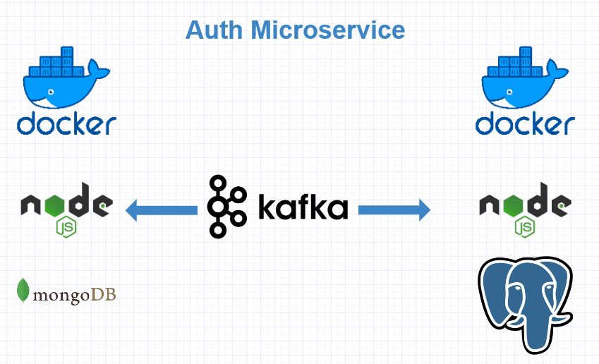

<div align="center">
<h1>Nodejs Docker Kafka Microservice</h1>
   <div align="center">
    
  </div>
   <h2>Authentication Microservice that writes data to Mongodb and Postgres using Kafka Queue</h2>
</div>

## Installation steps

1. Clone the Repo and install the requirements

```
git clone https://github.com/saadhaxxan/Nodejs-Docker-Kafka-Microservice.git
cd app_mongodb && npm install && cd.. && cd app_postgres && npm install
```

2. Install Docker from [here](https://docs.docker.com/engine/install/)
3. Start Docker Compose
```
docker-compose up
```

## Author
You can get in touch with me on my LinkedIn Profile:

#### Saad Hassan
[](https://www.linkedin.com/in/saadhaxxan)

You can also follow my GitHub Profile to stay updated about my latest projects: [](https://github.com/saadhaxxan)

If you liked the repo then kindly support it by giving it a star ⭐!

## Contributions Welcome
[](#)

If you find any bug in the code or have any improvements in mind then feel free to generate a pull request.
